<div align="center">

[](README.md)
[](README.ru.md)
[](README.uz.md)

</div>

# Wi-Fi & Network Diagnostics Toolkit


[](https://github.com/uMax-Cyber/NetPulse/actions/workflows/ci.yml)

Structured methodology for diagnosing Wi-Fi problems in production: from DHCP pool exhaustion to sticky clients, RF congestion to dead spots. Includes topology mapping, DHCP lease analysis, and roaming quality assessment.

## Philosophy: General → Specific

**Never start with wireshark.** Follow the diagnostic ladder:
1. **Scope** — who/what/where/when (which SSID, VLAN, devices)
2. **Passive metrics** — RSSI, retry rates, channel utilization, satisfaction
3. **DHCP path** — pool size vs utilization, lease events, relay path
4. **Time correlation** — constant (config) vs peak-time (load)
5. **Targeted capture** — only now, at the specific point of anomaly

## Key Discovery: DHCP Pool Exhaustion (Check FIRST)

**Symptom**: New devices stuck on "connecting...", existing devices work fine.
**Check**: Unique IPs issued vs pool capacity.

```bash
# Count unique IPs issued in DHCP logs
grep "DHCP Server" /var/log/dhcp.log | \
  grep -oE 'reported_ip="10\.X\.Y\.[0-9]+"' | sort -u | wc -l
# Compare against pool size
```

**Why it's missed**: "Wired works fine" doesn't exclude DHCP — different VLANs have separate pools.

## Scripts

| Script | Purpose |
|--------|---------|
| `scripts/dhcp_pool_check.py` | Compare issued IPs vs pool capacity |
| `scripts/topology_map.py` | Build switch/AP/client tree from controller API |
| `scripts/roam_quality.py` | Analyze roaming events (bad roams = both ends < -75dBm) |
| `scripts/port_audit.py` | Full switch port inventory (VLAN, PoE, errors, flaps) |

## Real Cases Solved

### Case 1: "connecting..." on Wi-Fi
Root cause: DHCP pool exhausted (459 unique IPs in 455-address pool). Fixed by expanding pool ×2.

### Case 2: Client on 1st floor connects to 3rd floor AP
Root cause: No min RSSI kick configured. Client holds onto distant AP through concrete walls, getting -82dBm signal. 58k retransmissions. Fixed by setting min RSSI to -75/-80dBm.

### Case 3: Dead spots (IP + link OK, no packets)
Root cause: Airtime congestion — 627 clients on 3 channels of 2.4GHz. Massive retry storms (worst: 58,106 retries on single client). Fixed by enabling 5GHz (after RAM upgrade on gateway VMs).

## Stack
- UniFi Controller API (legacy REST)
- Sophos Firewall XML API
- Python (stdlib only)
- rsyslog for centralized logging

## License
MIT

## 📬 Contact

Questions? Reach out: **[allumaxmail@gmail.com](mailto:allumaxmail@gmail.com)**

---

<div align="center">

[](README.md)
[](README.ru.md)
[](README.uz.md)

</div>
